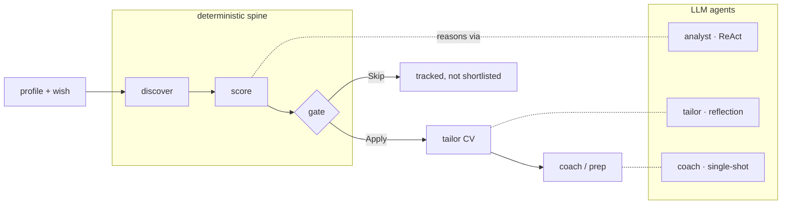

# multi-agent-jobHunter

> Discover live Malaysian jobs, score each one against your profile with reproducible math, and prep tailored application + interview material — with a **human in the loop for every outbound action.** It never applies for you.


A **hybrid agentic workflow** for job hunting in Malaysia. A deterministic spine (discovery, scoring math, storage, routing gates) hosts three LLM agents (analyst, tailor, coach) that reason *only* where judgement is genuinely open-ended.

## Why

Job boards are noisy, applying is repetitive, and generic AI tools happily invent experience you don't have. This tool does the grind — finding real postings and judging fit against *your* resume — while keeping two hard guarantees: **it never fabricates** (candidate-facing text derives only from your own files, enforced in code) and **it never submits** anything on your behalf. You review, then you apply.

## How it works



The **spine** (graph, discovery, scoring math, storage, gates) gives every run a reproducible shape. The **agents** supply non-deterministic judgement only where the task is open-ended. Same inputs → same verdict, every time. See [`ARCHITECTURE.md`](ARCHITECTURE.md) for the full design and [`DEVELOPMENT.md`](DEVELOPMENT.md) for the staged build.

## Screenshots

> _The Streamlit UI streams the analyst's live reasoning and a ranked shortlist. Drop a GIF/screenshots in `docs/` and link them here._
>
> <!--  -->

## Requirements

- **Python 3.11+**
- A **DeepSeek API key** (required) — the LLM backend for all three agents.
- A **Tavily API key** (optional) — enables real web search for company-legitimacy checks; without it, legitimacy degrades to JD-only judgement.

## Quickstart

```bash
git clone <this-repo> && cd multi-agent-jobHunter
python -m venv .venv
.venv/Scripts/activate               # Windows;  source .venv/bin/activate on macOS/Linux
pip install -r requirements.txt
cp .env.example .env                  # then add your DeepSeek key

# turn a resume + a plain-English wish into a saved profile
python -m src.cli onboard --resume data/profile.example.md \
    --wish "senior machine learning engineer in Kuala Lumpur, remote ok, ~RM12000"

# run the full hunt: discover → score → track → shortlist
python -m src.cli run --limit 5

# reprint the tracker any time
python -m src.cli status
```

`.env` holds only secrets (it's gitignored):

```
DEEPSEEK_API_KEY=sk-...
TAVILY_API_KEY=            # optional; leave blank to disable web search
```

## What it does

- **Discovery** — real Malaysian jobs over public front-end APIs (JobStreet MY v5 primary, Glints secondary), zero login / zero LLM cost.
- **Analyst (ReAct)** — scores each posting across weighted dimensions (role, skills, comp, location, growth, legitimacy) with evidence, calling read-only tools for facts the JD lacks.
- **Scoring (pure math)** — deterministic weighting + threshold gate; tune it in `config.yaml` with no prompt-fiddling. Same inputs → same verdict, every time.
- **Tracker** — human-readable, git-diffable canonical files in `data/` (idempotent, atomic writes).
- **Tailor / Coach** — tailor a CV without fabricating facts; produce a skill-gap + study plan + mock questions.

`run` writes canonical files under `data/`:
- `applications.md` — the master tracker (one row per evaluated job)
- `reports/NNN-*.md` — full evaluation per job (JD + per-dimension scores + evidence)
- `pipeline.md` — the discovered-postings inbox

### Example output

`data/applications.md` after a run — scores below the threshold are auto-marked *Skip*:

| Date | Company | Role | Score | Status |
|------|---------|------|-------|--------|
| 2026-07-11 | Snappymob | Senior Machine Learning Engineer | 9.1 | Apply |
| 2026-07-11 | FootfallCam | Graduate AI Engineer | 8.85 | Apply |
| 2026-07-11 | ADF Technologies | Data Scientist (Mid / Senior) | 8.4 | Apply |
| 2026-07-11 | Maybank | AI Data Scientist, AI/ML CoE | 7.7 | Apply |
| 2026-07-11 | Lenovo | Associate Engineer (Fresh Grad) | 6.75 | Apply |
| 2026-07-11 | Petrosains | Executive, Learning Content Development | 4.65 | Skip |

Review the shortlist and reports, then **apply yourself**. The tool never submits anything.

## Web UI (Streamlit)

A browser frontend surfaces the same features (it reuses the exact backend — the CLI keeps working).

```bash
pip install -r requirements-ui.txt      # streamlit, on top of requirements.txt
streamlit run app/Home.py
```

Pages (sidebar):
- **Onboard** — upload/paste a resume + a wish → saved profile.
- **Hunt** — configure and run the pipeline with live progress → ranked shortlist.
- **Results** — per-job scores + evidence, JD, tailored CV, and interview prep pack.
- **Tracker** — full application history + report browser + CSV/JSON export.
- **Tune** — drag scoring-weight sliders to **re-rank instantly with no AI cost**; save weights back to `config.yaml`.

The UI is transport only — all logic lives in `app/backend.py`, which calls the same `src/` agents and services. Re-ranking and viewing past runs make **zero** AI calls (they read the persisted `data/last_run.json`). No page ever applies on your behalf.

## Configuring

Everything you tune lives in [`config.yaml`](config.yaml) (values only; the secret stays in `.env`):

- **Scoring weights** (`scoring.weights`) — must sum to 1.0. Change them to change the ranking, no LLM re-run needed.
- **Threshold** (`scoring.threshold`, 0–10) — below this a job is marked *Skip* (default `6.0`).
- **Legitimacy floor** (`scoring.legitimacy_floor`) — a scam/ghost-level legitimacy score is a hard Skip (default `4.0`).
- **Providers** (`discovery.providers`) and **result cap** (`discovery.max_results_per_provider`).
- **Models** (`llm.models.pro` / `flash`) and their `max_tokens`.
- **Analyst** (`analyst.max_steps`, `analyst.thinking`) — ReAct loop bound and live chain-of-thought streaming.

## Adding a job source

Discovery is one-file-per-source. To add a board:

1. Create `src/services/providers/<name>.py` implementing the `Provider` protocol (`id`, `search(target) -> list[JobPosting]`, `fetch_detail(posting) -> str`). Route HTTP through a small `_get`/`_post` seam so it can be tested offline against a saved fixture.
2. Register it in `build_providers()` in `src/services/discovery.py`.
3. Add its name to `discovery.providers` in `config.yaml`.

No orchestration, agent, or scoring change is required.

## Testing

```bash
pytest                 # hermetic suite — no network, no LLM (default)
pytest -m live         # live integration tests (need DEEPSEEK_API_KEY + network)
```

Hermetic tests stub the LLM and network; live tests are marked and deselected by default (see `pytest.ini`).

## Troubleshooting

| Symptom | Fix |
|---------|-----|
| `DEEPSEEK_API_KEY` errors on `run` | Copy `.env.example` → `.env` and paste your key. `.env` is gitignored. |
| Discovery returns 0 jobs | Widen the `--wish` (role/location), raise `max_results_per_provider`, or check the provider isn't down — endpoints are unofficial and best-effort. |
| Company legitimacy always "unknown" | Add a `TAVILY_API_KEY` to `.env` — without it, web search is disabled and legitimacy falls back to JD-only. |
| Glints rate-limited / slow | It's throttled by design and disabled by default in `config.yaml`; re-enable only if you need a second source. |
| PDF resume extracted poorly | The loader quality-checks extracted text; if it's garbled, pass a `.txt`/`.md` resume instead. |

## Project layout

```
src/
  agents/         onboarding · analyst (ReAct) · tailor (reflection) · coach
  tools/          read-only, LLM-callable wrappers over services
  orchestration/  state (JobHuntState) · graph (Pipeline) · routing gates
  services/       providers/ · discovery · dedup · liveness · scoring · tracker
                  export · render · llm_client · resume_loader
  models.py       all typed data shapes      prompts.py  all prompt text
  config.py       loads config.yaml + .env   cli.py      onboard | run | status
data/             canonical user files (tracker, reports) — written only via the tracker at runtime
```

## Notes

- Endpoints are unofficial front-end APIs, wrapped behind a swappable `Provider` — legal-clean and fast, but treat them as best-effort. Glints is throttled to avoid rate limits.
- Never fabricate: candidate-facing text derives only from your own files (enforced in code, not just prompted).
</content>
</invoke>
